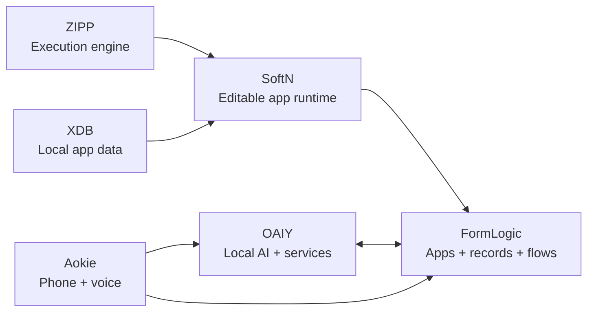

<h1 align="center">FormLogic</h1>

<p align="center"><strong>Forms → Apps → Flows</strong></p>

<p align="center">
  Turn structured data into complete business software: forms, records, portals, dashboards, reports, automations, hosted apps and AI-assisted workflows in one connected platform.
</p>

<p align="center">
  
  
  
  
</p>

<p align="center">
  <a href="https://formlogic.com/"><strong>Website</strong></a>
  ·
  <a href="https://formlogic.com/#live-demo"><strong>Live demo</strong></a>
  ·
  <a href="https://formlogic.com/signup"><strong>Create an account</strong></a>
  ·
  <a href="docs/README.md"><strong>Documentation</strong></a>
  ·
  <a href="#self-host-formlogic"><strong>Self-host</strong></a>
</p>

<p align="center">
  
</p>

---

## A form submission should start the work, not end it

FormLogic is a **source-available, self-hostable business application platform** built around a simple idea: your interface, data and automation should stay connected.

Start with a form or an installable app. Turn the same records into a customer portal, a staff workspace, dashboards and reports. Then connect events, decisions, AI, services and devices through flows.

| Capture                                                                                                         | Operate                                                                                     | Automate                                                                              |
| --------------------------------------------------------------------------------------------------------------- | ------------------------------------------------------------------------------------------- | ------------------------------------------------------------------------------------- |
| Build public and internal forms with validation, conditional logic, uploads, linked records and custom screens. | Turn shared data into branded apps, portals, dashboards, reports and role-aware workspaces. | Trigger flows from submissions, record changes, connected services and device events. |
| Start visually, from a template, from a marketplace app or with AI assistance.                                  | Give different audiences different interfaces over the same underlying records.             | Call AI providers, APIs, backend actions, local services and approved plugins.        |

**You do not need AI to use FormLogic.** Manual builders, starters, apps, records and flows work independently. AI is an optional capability you connect when it is useful.

---

## What you can build

### Forms that grow into applications

Create structured data models using the visual form builder, then reuse them across multiple experiences instead of copying data between disconnected tools.

* validation and conditional logic
* linked records and relationships
* file uploads, signatures, locations and calculated fields
* public and authenticated forms
* version history, webhooks and server-side submit logic
* reusable form templates loaded from project files

### One backend, many portals

A customer portal, staff app and administrator workspace can all use the **same forms and records** while keeping their own navigation, branding, roles, dashboards and reports.

That means a customer can submit a request, a staff member can work the queue, and an administrator can report across everything without maintaining three separate databases.

[Read the connected portal model](docs/ONE_BACKEND_MANY_PORTALS.md)

### Dashboards and reports

Build operational views from the records already flowing through the system:

* KPI cards
* charts and trends
* record lists and tables
* activity views
* app-level and form-level dashboards
* printable reports and PDFs

### Visual flows

Flows connect events to actions. A run can branch, transform data, call a model, operate a connector, invoke a backend action, interact with a local service or update FormLogic records.

Typical triggers include:

* form submissions
* hosted app database changes
* connector events
* device/plugin events
* manual runs

Runs are tracked so automations remain inspectable rather than disappearing into a black box.

[Read the flow contract](docs/FORMLOGIC_FLOWS.md)

---

## Editable apps with SoftN

FormLogic can host complete **[SoftN](https://github.com/f2i-com/softn.com)** applications, not just fixed templates.

A SoftN project can contain its editable interface, client logic, assets and local data model. Inside FormLogic, a hosted app can also gain private server-side `.logic` routes, SQLite migrations, backend actions and FormLogic-managed authentication.

From App Studio you can work across the stack:

| Work on                 | In FormLogic                                                             |
| ----------------------- | ------------------------------------------------------------------------ |
| **Interface**           | Open the embedded SoftN Visual Builder.                                  |
| **Source**              | Edit `.ui` and `.logic` files directly.                                  |
| **AI-assisted changes** | Open AI Studio with the provider you choose.                             |
| **Private backend**     | Manage server-side logic separately from downloadable client source.     |
| **SQLite records**      | Inspect and administer hosted app data.                                  |
| **Automation**          | Bind app record events to FormLogic flows.                               |
| **Portability**         | Download the editable client project when you want to take it elsewhere. |

<p align="center">
  
</p>

FormLogic installs the hosted SoftN runtime, embedded editors and native backend modules from a verified SoftN release. The release is checked before installation so the runtime used by a FormLogic build is explicit and reproducible.

[Build and host a SoftN app](docs/HOSTED_APPS.md) · [Editable app packs](docs/PACK_PROJECTS.md)

---

## Bring your own AI

FormLogic is designed to work with the AI setup you already prefer.

You can connect:

* **[OAIY](https://github.com/f2i-com/oaiy.com)** for local models, provider connections, local services, plugins and headless execution
* an OpenAI-compatible or other supported API provider
* external AI clients through scoped OAuth/MCP access

AI can help create and modify forms, apps and workflows, but it does not become the owner of your project. Your forms, records, app definitions and permissions remain FormLogic resources.

<p align="center">
  
</p>

[AI setup](docs/FREE_PLANS_AND_AI_SETUP.md) · [MCP integration](docs/MCP.md)

---

## One connected F2i ecosystem

FormLogic is part of **[F2i](https://f2i.com/)**, an independent software lab building connected projects from low-level runtimes to end-user applications.

Each project can stand on its own. Where they connect, the boundaries are intentional.

| Project                                           | Role in the ecosystem                                                                                                                                                         |
| ------------------------------------------------- | ----------------------------------------------------------------------------------------------------------------------------------------------------------------------------- |
| **FormLogic**                                     | Forms, business records, apps, portals, dashboards, reports, access control, flows, hosting and APIs.                                                                         |
| **[SoftN](https://github.com/f2i-com/softn.com)** | Portable editable applications, Visual Builder, AI Studio and the app runtime used by hosted FormLogic workspaces.                                                            |
| **[ZIPP](https://github.com/f2i-com/zipp.org)**   | Rust execution engine used for sandboxed application and form logic, with native and WebAssembly runtimes.                                                                    |
| **[XDB](https://github.com/f2i-com/xdb.org)**     | Local-first SQLite/CRDT storage used by SoftN native/server environments where local app data is appropriate. FormLogic business records use FormLogic's own backend storage. |
| **[OAIY](https://github.com/f2i-com/oaiy.com)**   | Local and headless execution layer for AI providers, models, services, supervised plugins and connected flows.                                                                |
| **[Aokie](https://github.com/f2i-com/aokie.com)** | Local-first phone/voice plugin that turns calls, messages and appointment requests into structured FormLogic work.                                                            |



The important separation is deliberate:

* **SoftN** owns the portable app experience.
* **ZIPP** executes sandboxed logic.
* **XDB** provides local app storage where that model fits.
* **FormLogic** owns hosted business records, permissions and operational workflows.
* **OAIY** owns local capabilities and background/headless execution.
* **Aokie** brings real-world phone events into that workflow.

---

## Aokie: a real-world example

**[Aokie](https://github.com/f2i-com/aokie.com)** shows what the connected architecture is for.

A supported mobile phone connects to an OAIY-managed Aokie plugin over Bluetooth. Aokie handles call control, audio, speech and durable call/SMS events. FormLogic hosts the editable front-desk app, stores the business records and runs the workflows around each conversation.

A phone call can become:

1. a call record
2. a transcript
3. a caller or customer match
4. an appointment request
5. a follow-up task
6. a notification or workflow run

The phone remains the phone. OAIY supplies the local capability. FormLogic turns the event into structured work.

> [!IMPORTANT]
> Aokie is currently a hardware beta. Auto-answer is opt-in, hardware compatibility varies, and appointment requests should be confirmed by staff or an intentionally configured workflow.

[Aokie setup](https://formlogic.com/aokie) · [Hardware guide](https://github.com/f2i-com/aokie.com/blob/main/docs/HARDWARE.md)

---

## Start with a working app

You do not have to begin with an empty canvas.

FormLogic's marketplace contains installable business app packs covering areas such as field service, workshops, hospitality, retail, compliance, administration and front-desk workflows.

A pack can bring together:

* forms and linked data
* SoftN workspaces
* dashboards and reports
* roles and permissions
* flows and event bindings
* backend logic and database migrations where required

Install one, inspect how it works, customise it, or use it as the starting point for a completely different application.

---

## Self-host FormLogic

FormLogic is designed to run on infrastructure you control.

### Requirements

* PHP 8.2+
* MySQL 8.0+
* Composer
* Node.js matching the repository's `.node-version` for builds and hosted app runtime preparation
* npm
* Git

For a clean source checkout:

```bash
git clone https://github.com/f2i-com/formlogic.com.git
cd formlogic.com/formlogic/ui

npm install
node ../../scripts/fetch-softn-release.mjs

cd ..
chmod +x install.sh
./install.sh
```

The SoftN fetch step downloads and verifies the hosted runtime, embedded editors and native backend modules before installing them into the FormLogic tree.

For manual installation, Windows/WAMP/XAMPP setup, production HTTPS configuration, web-server examples and upgrade procedures, use the full guides:

* [Developer setup](formlogic/README.md)
* [Deployment](DEPLOYMENT.md)
* [Upgrading](docs/UPGRADING.md)
* [Release runbook](docs/RELEASE_RUNBOOK.md)

> [!WARNING]
> Production deployments must protect backend storage and secrets. Serve the built frontend and the backend `public/` directory only, use HTTPS, and follow the deployment guide rather than exposing the source tree through the web server.

---

## Repository layout

```text
formlogic.com/
├── formlogic/
│   ├── backend/          PHP/Slim API, workers, migrations and storage
│   ├── ui/               React + TypeScript application and builders
│   ├── native-runtime/   Optional native application shell
│   ├── runtime/          Sandboxed form/script runtime integration
│   ├── install.php       Browser-assisted installer
│   └── install.sh        CLI-assisted installer
├── docs/                 Product, architecture, API and operations guides
├── scripts/              Build, release and ecosystem integration tooling
├── DEPLOYMENT.md         Production deployment guidance
├── LAUNCH_CHECKLIST.md   Release and launch verification
├── SECURITY.md           Security policy
└── README.md             Product overview
```

OAIY and Aokie live in their own repositories. The optional `native-runtime/` shell in this repository is not the OAIY desktop host.

---

## Architecture at a glance

| Layer                         | Main technologies                                                        |
| ----------------------------- | ------------------------------------------------------------------------ |
| **Web application**           | React 19, TypeScript, Vite, Tailwind CSS, Zustand and React Router       |
| **Visual builders**           | Drag-and-drop UI tooling, flow graph editing and embedded source editors |
| **Backend**                   | PHP 8.2+, Slim 4 and MySQL platform metadata                             |
| **Hosted app data**           | Isolated SQLite storage for hosted application backends                  |
| **Sandboxed logic**           | ZIPP in browser/server execution paths with explicit host capabilities   |
| **Portable app runtime**      | SoftN runtime and embedded editors installed from a verified release     |
| **Local/headless capability** | OAIY Desktop and headless runtime                                        |
| **Phone integration**         | Aokie plugin, Bluetooth call/audio handling and durable event delivery   |

FormLogic keeps trust boundaries explicit. Downloadable client projects do not silently contain server credentials or private backend databases. Connected local capabilities require approval, and server-side permissions remain authoritative.

---

## Documentation

| I want to…                          | Read                                       |
| ----------------------------------- | ------------------------------------------ |
| Understand the documentation map    | [Documentation index](docs/README.md)      |
| Run FormLogic locally               | [Developer setup](formlogic/README.md)     |
| Build or host a SoftN application   | [Hosted apps](docs/HOSTED_APPS.md)         |
| Connect apps, OAIY or Aokie         | [Connected apps](docs/CONNECTED_APPS.md)   |
| Understand flows and event bindings | [Flows](docs/FORMLOGIC_FLOWS.md)           |
| Connect an external AI client       | [MCP](docs/MCP.md)                         |
| Use the REST API                    | [API reference](docs/API.md)               |
| Deploy to production                | [Deployment](DEPLOYMENT.md)                |
| Prepare a release                   | [Release runbook](docs/RELEASE_RUNBOOK.md) |
| Report or review security concerns  | [Security policy](SECURITY.md)             |

---

## Security

FormLogic handles application data, automation and authenticated business workflows, so deployment boundaries matter.

The project includes controls around areas such as:

* server-enforced roles and permissions
* authenticated sessions and scoped access
* sandboxed user/application logic
* guarded outbound requests
* isolated hosted application data
* explicit plugin and local-runtime approvals
* release, recovery and deployment verification

Security behavior is implementation-specific and continues to evolve during beta. Review [SECURITY.md](SECURITY.md), the deployment guide and the current source before relying on a feature as a security boundary.

---

## License

FormLogic is **proprietary, source-available software**. It is not open source.

The licence allows you to:

* run and self-host FormLogic for free
* use it for personal, internal and commercial business operations
* inspect and modify the source for your own use
* share the software or your modifications for free with the required notices intact

Without a separate commercial agreement, you may not resell FormLogic, offer it as a competing paid/hosted service, or charge third parties to host or operate it on their behalf.

See [LICENSE](LICENSE) for the complete terms.

---

## Related projects

* [F2i](https://f2i.com/) - the wider project ecosystem
* [SoftN](https://github.com/f2i-com/softn.com) - editable app language, builder and runtime
* [ZIPP](https://github.com/f2i-com/zipp.org) - Rust JavaScript/Python execution engine
* [XDB](https://github.com/f2i-com/xdb.org) - local-first SQLite and CRDT storage
* [OAIY](https://github.com/f2i-com/oaiy.com) - local AI and workflow orchestration
* [Aokie](https://github.com/f2i-com/aokie.com) - local AI phone receptionist and hardware integration

---

<p align="center">
  <strong>Build the interface. Keep the data connected. Automate what happens next.</strong>
</p>

<p align="center">
  <a href="https://formlogic.com/">FormLogic.com</a>
  ·
  <a href="docs/README.md">Documentation</a>
  ·
  <a href="https://github.com/f2i-com">F2i on GitHub</a>
</p>
