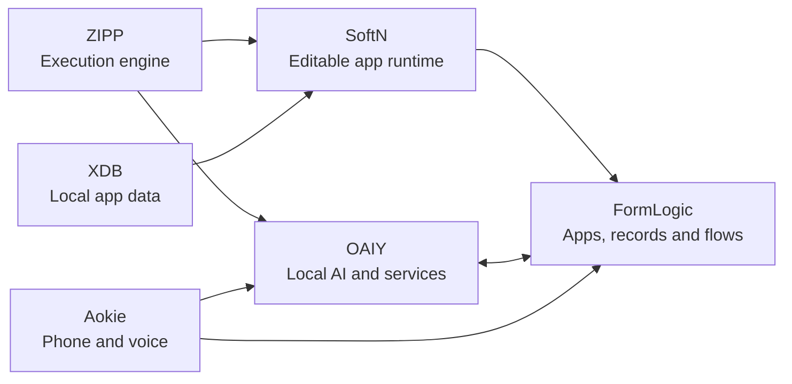

<h1 align="center">F2i</h1>

<strong>Independent minds. Connected ideas.</strong>

  An independent software lab building public software from the runtime to the app: a scripting engine, a portable app language, a business platform, a local AI workspace, a phone receptionist and a local-first database. Six projects, one connected lab.

  
  
  
  

  <a href="https://f2i.com/"><strong>f2i.com</strong></a>
  ·
  <a href="#the-projects"><strong>The projects</strong></a>
  ·
  <a href="#how-the-pieces-fit-together"><strong>How they fit together</strong></a>
  ·
  <a href="#start-here"><strong>Start here</strong></a>
  ·
  <a href="#licences"><strong>Licences</strong></a>

  <a href="https://github.com/f2i-com/zipp.org">ZIPP</a>
  ·
  <a href="https://github.com/f2i-com/softn.com">SoftN</a>
  ·
  <a href="https://github.com/f2i-com/formlogic.com">FormLogic</a>
  ·
  <a href="https://github.com/f2i-com/oaiy.com">OAIY</a>
  ·
  <a href="https://github.com/f2i-com/aokie.com">Aokie</a>
  ·
  <a href="https://github.com/f2i-com/xdb.org">XDB</a>

---

## Big ideas, built from the source

Most software stacks hide the interesting parts. F2i builds them in the open, one layer at a time, and connects them on purpose.

A script written in [SoftN](https://github.com/f2i-com/softn.com) runs on the [ZIPP](https://github.com/f2i-com/zipp.org) engine. That app can be hosted by [FormLogic](https://github.com/f2i-com/formlogic.com) with real business records, permissions and automation. A flow in [OAIY](https://github.com/f2i-com/oaiy.com) can call the AI you already have, locally or through a provider. [Aokie](https://github.com/f2i-com/aokie.com) turns a phone call into structured work. [XDB](https://github.com/f2i-com/xdb.org) keeps app data local where that model fits.

Every project stands on its own. Where they connect, the boundaries are deliberate.

| Built in public | Local-first thinking | From Rust to the browser | Yours to explore |
| :-- | :-- | :-- | :-- |
| Source, docs, benchmarks and audits live in the repositories. | Your data, your models and your keys stay on machines you control. | Native engines and WebAssembly builds share the same code. | Read the source, run the demos, download the editable app. |

---

## The projects

<table>
<tr>
<td width="50%" valign="top">

### <a href="https://github.com/f2i-com/zipp.org">ZIPP</a> · Execution engine

**Two languages. One VM. Your GPU.**

A from-scratch JavaScript engine in Rust with 100% Test262 conformance. JavaScript and an experimental Python frontend compile to the same register VM, running natively or in WebAssembly, with WebGPU and WebGL2 compute for supported workloads. Execution budgets and explicit host capabilities keep the embedder in control.

`Rust` · `Apache-2.0` · `Native + WebAssembly`

[Repository](https://github.com/f2i-com/zipp.org) · [zipp.org](https://www.zipp.org/) · [Test262](https://www.zipp.org/test262/) · [Benchmarks](https://www.zipp.org/benchmarks/)

</td>
<td width="50%" valign="top">

</td>
</tr>
<tr>
<td width="50%" valign="top">

</td>
<td width="50%" valign="top">

### <a href="https://github.com/f2i-com/softn.com">SoftN</a> · Editable apps

**Build an app. Keep the source. Run it your way.**

A UI language, visual builder and runtime for portable apps on the web and desktop. Ninety built-in components, a schema editor, live previews and an AI Studio that uses your own provider. App logic runs on ZIPP; records live in XDB. A `.softn` bundle carries the whole app so you can reopen, customise and export it again.

`TypeScript` · `Apache-2.0` · `Web + desktop`

[Repository](https://github.com/f2i-com/softn.com) · [softn.com](https://softn.com/) · [Examples](https://github.com/f2i-com/softn-Examples)

</td>
</tr>
<tr>
<td width="50%" valign="top">

### <a href="https://github.com/f2i-com/formlogic.com">FormLogic</a> · Forms → Apps → Flows

**A form submission should start the work, not end it.**

A source-available, self-hostable business platform. Build forms, turn the same records into portals, dashboards and reports, then connect events, decisions, AI and devices through visual flows. FormLogic hosts complete SoftN apps with private server-side logic, and takes its runtime from a verified SoftN release.

`TypeScript + PHP` · `Source-available` · `Public beta` · `Cloud or self-hosted`

[Repository](https://github.com/f2i-com/formlogic.com) · [formlogic.com](https://formlogic.com/) · [Live demo](https://formlogic.com/#live-demo) · [Docs](https://github.com/f2i-com/formlogic.com/blob/main/docs/README.md)

</td>
<td width="50%" valign="top">

</td>
</tr>
<tr>
<td width="50%" valign="top">

</td>
<td width="50%" valign="top">

### <a href="https://github.com/f2i-com/oaiy.com">OAIY</a> · Orchestrate AI Yourself

**Connect your AI. Build a flow. Put it to work.**

A visual flow editor, local AI services, provider connections and device plugins in one workspace. Use a local model, an API provider or your ChatGPT account through Codex. Run flows in the browser, headless, or through OAIY Desktop, and connect apps such as FormLogic to the runtime on your own machine. The flow sandbox runs on ZIPP.

`TypeScript + Rust` · `Apache-2.0` · `Local-first`

[Repository](https://github.com/f2i-com/oaiy.com) · [oaiy.com](https://oaiy.com/) · [Bridge protocol](https://github.com/f2i-com/oaiy.com/blob/main/protocol/README.md)

</td>
</tr>
<tr>
<td width="50%" valign="top">

### <a href="https://github.com/f2i-com/aokie.com">Aokie</a> · Local AI receptionist

**Your phone. A local AI receptionist. An editable front desk.**

A Windows PC, a supported USB Bluetooth adapter and your existing mobile become a receptionist that keeps your number. Aokie handles the call audio and voice conversation through OAIY, then sends durable call, SMS, transcript and appointment events into FormLogic. The front desk itself is an editable SoftN app.

`Rust` · `Proprietary` · `Hardware beta` · `Windows 10/11 x64`

[Repository](https://github.com/f2i-com/aokie.com) · [Setup guide](https://formlogic.com/aokie) · [Supported hardware](https://github.com/f2i-com/aokie.com/blob/main/docs/HARDWARE.md)

</td>
<td width="50%" valign="top">

</td>
</tr>
<tr>
<td width="50%" valign="top">

</td>
<td width="50%" valign="top">

### <a href="https://github.com/f2i-com/xdb.org">XDB</a> · Local-first database

**Local SQLite storage with optional peer synchronisation.**

A Rust crate and React + Tauri integration that stores JSON records in named collections. Apps work offline, group writes into transactions and export or restore a SQLite database. Yrs CRDT documents and an experimental, opt-in libp2p peer protocol handle synchronisation. XDB backs SoftN's desktop runtime and Rust server.

`Rust + TypeScript` · `MIT` · `SQLite + CRDT`

[Repository](https://github.com/f2i-com/xdb.org) · [Sync and restore policy](https://github.com/f2i-com/xdb.org/blob/main/docs/networking-and-restore-policy.md)

</td>
</tr>
</table>

---

## How the pieces fit together

| Project | Owns | Never owns |
| :-- | :-- | :-- |
| **ZIPP** | Sandboxed execution of JavaScript and Python, natively and in WebAssembly. | Anything about the apps that run on it. |
| **SoftN** | The portable app: interface, client logic, data model and editors. | Hosted business records or server credentials. |
| **XDB** | Local app storage and peer synchronisation where that model fits. | FormLogic business records, which use FormLogic's own backend. |
| **FormLogic** | Hosted records, permissions, portals, dashboards, flows and APIs. | Your AI provider or your local machine. |
| **OAIY** | Local models, provider connections, services, plugins and headless flow execution. | The business workflow around an event. |
| **Aokie** | Bluetooth call audio, SMS, the voice conversation and a durable event outbox. | Your phone number, which stays where it is. |

Engines move between projects as releases, not as commits. SoftN builds on a published ZIPP release and ships it inside its own release archive. FormLogic downloads and verifies that SoftN release before installing it. The set of versions in any build is explicit and reproducible.

---

## A phone call, end to end

Aokie shows what the connected architecture is for.

1. A caller rings your existing mobile. Aokie answers over Bluetooth and holds the conversation with a local or provider model through OAIY.
2. The call, transcript and any appointment request are written to a durable outbox and delivered to FormLogic.
3. FormLogic matches the caller, stores the records and runs the flows you configured: a follow-up task, a notification, a callback attempt.
4. Staff work the queue in the front desk app, which is a SoftN app they can download, edit and re-host.

The phone remains the phone. OAIY supplies the local capability. FormLogic turns the event into structured work.

> [!NOTE]
> Aokie is a hardware beta. Auto-answer is opt-in, hardware compatibility varies, and appointment requests are requests until a person or a configured flow confirms them.

---

## Start here

| I want to… | Go to |
| :-- | :-- |
| Try a working app without installing anything | [Fieldnotes on SoftN](https://github.com/f2i-com/softn.com/tree/main/examples/fieldnotes) · [FormLogic live demo](https://formlogic.com/#live-demo) |
| Run FormLogic on my own server | [Self-hosting guide](https://github.com/f2i-com/formlogic.com/blob/main/DEPLOYMENT.md) |
| Embed a JavaScript or Python engine in Rust | [ZIPP quick start](https://github.com/f2i-com/zipp.org#quick-start) |
| Run GPU compute from Python in the browser | [ZIPP GPU lab](https://github.com/f2i-com/zipp.org#start-the-local-gpu-lab) |
| Connect my own AI to FormLogic | [OAIY setup](https://github.com/f2i-com/oaiy.com#set-up-your-ai) · [FormLogic AI setup](https://github.com/f2i-com/formlogic.com/blob/main/docs/FREE_PLANS_AND_AI_SETUP.md) |
| Turn my phone into a receptionist | [Aokie setup](https://formlogic.com/aokie) · [Supported hardware](https://github.com/f2i-com/aokie.com/blob/main/docs/HARDWARE.md) |
| Store local records in a Tauri app | [XDB demo](https://github.com/f2i-com/xdb.org#run-the-demo) |
| Play something built on the stack | [The Night Window](https://github.com/f2i-com/softn-TheNightWindow) · [Last Sound](https://github.com/f2i-com/softn-LastSound) |

---

## Also in the lab

| Repository | What it is |
| :-- | :-- |
| [softn-Examples](https://github.com/f2i-com/softn-Examples) | Every demo in the softn.com directory as source, from a snake game to a Game Boy, a 386 PC and a language model that never leaves the browser. |
| [softn-TheNightWindow](https://github.com/f2i-com/softn-TheNightWindow) | A fully voiced observation-horror game for SoftN. Seven nights, six endings. |
| [softn-LastSound](https://github.com/f2i-com/softn-LastSound) | A fully voiced first-person survey of a blood ocean, built for SoftN. |
| [neuralautomata.com](https://github.com/f2i-com/neuralautomata.com) | A local research lab for cellular memory and a causal byte language model, with a WebGL2 view of real model state. |
| [f2i-web](https://github.com/f2i-com/f2i-web) | The browser-based flow builder that OAIY grew out of: a node-graph editor for local AI engines, with an optional PHP backend for sharing flows and driving them remotely. |

---

## Licences

| Project | Licence |
| :-- | :-- |
| ZIPP, SoftN, OAIY | [Apache-2.0](https://www.apache.org/licenses/LICENSE-2.0) |
| XDB | [MIT](https://github.com/f2i-com/xdb.org/blob/main/LICENSE) |
| FormLogic | [FormLogic License 1.0](https://github.com/f2i-com/formlogic.com/blob/main/LICENSE): source-available, free to self-host and modify for your own use, not open source. |
| Aokie | Proprietary, pre-1.0. Contact FormLogic for licensing terms. |

Security concerns go to the project concerned. FormLogic, ZIPP and Aokie each publish a `SECURITY.md` with their reporting process; for the other projects, open an issue in that repository.

---

  <strong>Engines, tools, and a little unreasonable curiosity.</strong>

  <a href="https://f2i.com/">f2i.com</a>
  ·
  <a href="https://formlogic.com/">FormLogic</a>
  ·
  <a href="https://softn.com/">SoftN</a>
  ·
  <a href="https://www.zipp.org/">ZIPP</a>
  ·
  <a href="https://oaiy.com/">OAIY</a>

